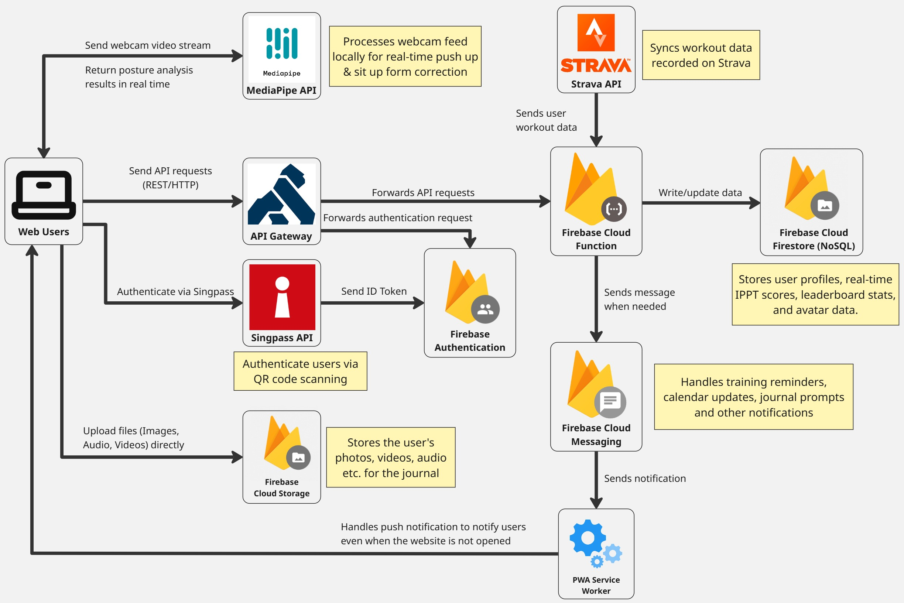

# Where Got Time

**Where Got Time** is a companion app for National Service (NS) that turns the slog of training into something you actually want to open. Instead of a dry fitness tracker, it wraps your NS journey in a game-like, scrapbook feel:

- **Train** — log workouts, run live training sessions (with on-device webcam form analysis via MediaPipe), and watch your stats climb.
- **Journal** — keep a personal field journal of your NS milestones (enlistment, BMT, field camp, POP, ORD…). Write a memory and the app can **generate a matching illustration with AI**, so each entry looks like a page from an illustrated war diary. Finished journals can be shared as a read-only link.
- **Profile & avatar** — customise a pixel-art soldier avatar (swap tops, bottoms, shoes, accessories) and spend earned XP in the shop.
- **Stay on track** — installable as a PWA with web push reminders, so it lives on your phone's home screen like a real app.

It's built as a React single-page app on top of Firebase (Auth, Firestore, Cloud Storage, Cloud Functions, Hosting, and Cloud Messaging).

> **Status:** active prototype. Most features run against live Firebase services; a few screens (e.g. the shared-journal link) use baked-in demo data for the proof of concept. Calendar and Squad screens exist in the code but are currently hidden from the sidebar.

## Architecture



At a high level:

- Web users interact with the **React frontend**, installable as a **PWA**.
- **Firebase Authentication** owns the signed-in session (email/password and Google sign-in).
- **Firestore** stores user data — profiles, journal entries, training stats, avatar state.
- **Cloud Storage** holds journal media and AI-generated memory images.
- **AI memory images** are generated from the diary text the user writes. The original pipeline drives a **local ComfyUI** install (Stable Diffusion) directly from the browser; a later variant offloads this to a **Cloud Function** that calls a hosted image API (Pollinations). See [AI memory images](#ai-memory-images) for both.
- **Firebase Cloud Messaging + a PWA service worker** deliver reminders and notifications.
- Training **form analysis runs locally** in the browser through MediaPipe using the webcam stream — no video leaves the device.

## Quick Start — run it yourself

You'll need [Node.js](https://nodejs.org/) (v18+) and access to a Firebase project. If you just want to see the UI, you only need steps 1–4 (the frontend). Step 5 sets up the AI memory image feature, which in its original form runs against a local ComfyUI install on your own machine.

### 1. Clone and install

```cmd
git clone <this-repo-url>
cd chickenTaxi\frontend
npm install
```

### 2. Create a Firebase project

If you don't already have one:

1. Go to the [Firebase console](https://console.firebase.google.com/) and create a project.
2. Add a **Web app** to it (the `</>` icon). Firebase will show you a config object — you'll copy those values in the next step.
3. In the console, enable:
   - **Authentication** → Sign-in methods → **Email/Password** and **Google**.
   - **Firestore Database** (start in test mode for development).
   - **Storage**.

### 3. Configure environment variables

The app reads its Firebase config from a `.env` file. Copy the example and fill it in:

```cmd
copy .env.example .env
```

Then open `frontend/.env` and paste the values from your Firebase web app config:

```env
VITE_FIREBASE_API_KEY=...
VITE_FIREBASE_AUTH_DOMAIN=...
VITE_FIREBASE_PROJECT_ID=...
VITE_FIREBASE_STORAGE_BUCKET=...
VITE_FIREBASE_MESSAGING_SENDER_ID=...
VITE_FIREBASE_APP_ID=...
VITE_FIREBASE_VAPID_KEY=...        # only needed for web push notifications
```

If any required value is missing, the app logs a clear error in the browser console telling you which one. The full list lives in [`frontend/.env.example`](./frontend/.env.example).

### 4. Start the dev server

```cmd
npm run dev
```

Open the URL Vite prints (usually <http://localhost:5173/>). You can now sign up, log in, and explore Training, Journal, and Profile.

> **Note:** the AI "generate a memory image" button in the Journal needs an image generator running (step 5). Everything else works against your Firebase project right away.

### 5. (Optional) Set up AI memory image generation

See [AI memory images](#ai-memory-images) below for the full explanation of both approaches. In short:

- **Original — local ComfyUI** (no backend, no API key): run ComfyUI on your own machine and the browser talks to it directly. This is the default the project was built and demoed on.
- **Alternative — Cloud Function** (Pollinations API): offloads generation to a deployed Firebase Function so it works without a local GPU. Requires the Blaze plan.

Pick whichever fits your setup; the rest of the app is identical either way.

## Build & Deploy (Hosting)

The app is hosted on **Firebase Hosting**. Build the frontend, then deploy from the repo root:

```cmd
cd frontend
npm run build

cd ..
firebase deploy --only hosting
```

To deploy everything (hosting + functions) at once:

```cmd
firebase deploy
```

Hosting serves `frontend/dist` and rewrites all routes to `index.html` so client-side routing works (see [`firebase.json`](./firebase.json)).

## Codebase map

```txt
frontend/                 the React app — most work lives here
  index.html
  vite.config.js
  .env.example            required Firebase env vars (copy to .env)
  public/
    manifest.webmanifest        PWA manifest
    firebase-messaging-sw.js    FCM service worker
    assets/                     static images (brand, training, journal, avatar)
  src/
    main.jsx              app entry; mounts the router and AuthProvider
    App.jsx               route table (react-router-dom)
    routes.js             route keys -> URL-path mapping
    ui.jsx                shared shell, sidebar, cards, buttons, sprites
    assets.js             static asset manifest
    avatarConfig.js       avatar layer order and slot definitions
    auth/
      firebase.js         single Firebase initialisation (auth, db, storage, functions)
      AuthContext.jsx     app-wide auth state via useAuth()
      ProtectedRoute.jsx  route guard for signed-in-only pages
      notifications.js    FCM web push enable/disable/state helpers
    lib/
      aiMemoryImage.js    client wrapper for the Cloud Function image approach
    pages/
      RootPage.jsx        login / sign-up
      TrainingDashboard.jsx, TrainingSessionPage.jsx
      JournalPage.jsx, JournalLab.jsx     journal + the ComfyUI image POC (/journal/lab)
      AIMemoryModal.jsx, SharedBookPage.jsx
      ProfileMain.jsx, ProfileCustomizer.jsx, ShopPage.jsx
      CalendarPage.jsx, SquadPage.jsx   (in code, hidden from sidebar)

functions/                Cloud Functions (Node.js) — alternative image backend
  index.js                generateMemoryImage — Pollinations API, server-side

firebase.json             Hosting + Functions config
.firebaserc               Firebase project alias

backend/                  legacy placeholder (superseded by functions/)
```

## How it fits together

- **Auth** is initialised once in [`src/auth/firebase.js`](./frontend/src/auth/firebase.js) with LOCAL persistence, so a signed-in session survives a browser restart. `AuthProvider` exposes it through `useAuth()`:

  ```js
  const { user, loading, loginWithEmail, signupWithEmail,
          loginWithGoogle, logout } = useAuth();
  ```

  `user` is `null` when signed out, the Firebase User when signed in. Every route except `/login` and the public `/shared/...` link is wrapped in `ProtectedRoute`.

- **AI memory images**: the Journal turns a written memory into an illustration. There are two interchangeable backends — see [AI memory images](#ai-memory-images) for the full story.

- **Notifications & PWA**: the app ships a PWA manifest and an FCM service worker, so it can be installed to the home screen and receive web push. Helpers live in [`src/auth/notifications.js`](./frontend/src/auth/notifications.js); enabling push requires `VITE_FIREBASE_VAPID_KEY`.

## AI memory images

The signature feature of the Journal: you write a short memory ("6 of my buddies in my section drove a tank today, so cool!") and the app generates a matching illustration to paste into the polaroid frame on the journal page.

The project has gone through **two implementations of this**. They are interchangeable — the journal UI is the same either way; only what sits behind the "generate" button changes.

### Original approach — local ComfyUI (the default it was built on)

The original pipeline ([`src/pages/JournalLab.jsx`](./frontend/src/pages/JournalLab.jsx), route `/journal/lab`) drives a **ComfyUI** install running on your own machine, directly from the browser — **no backend and no API key**. This is how the app was developed and demoed.

How it works:

1. You type a diary line in the Journal Lab.
2. *(Optional)* A **local Ollama LLM** (`llama3.2`) rewrites the diary slang into a plain visual scene description ("shellscrape" → "muddy water-filled foxhole pit", etc.). If Ollama isn't running, it falls back to your raw text — the app never breaks.
3. `buildPrompt()` wraps that into a styled prompt (your text leads; a fixed anime/cinematic style and per-mood cues trail).
4. The app clones an **embedded ComfyUI workflow** (SDXL base + the `illustrious_flat_color` LoRA), injects the prompt and a random seed, and `POST`s it to ComfyUI's `/prompt` endpoint.
5. It polls `/history/{id}` until the job finishes, reads the `SaveImage` output, fetches it via `/view`, and drops it into the journal frame.

**To run it**, you need ComfyUI installed locally with the right model files, started with CORS enabled so the browser can call it:

```cmd
python main.py --enable-cors-header "*"
```

It serves at `http://127.0.0.1:8188` by default (the `COMFY` constant in `JournalLab.jsx` if yours differs). You'll need:

- **ComfyUI** — <https://github.com/comfyanonymous/ComfyUI>
- Checkpoint: `sd_xl_base_1.0.safetensors`
- LoRA: `illustrious_flat_color_v2.safetensors`
- *(Optional)* **Ollama** with `llama3.2` for the diary-to-scene rewrite — <https://ollama.com> (`ollama pull llama3.2`)

> **Trade-off:** this needs a capable local GPU and a running ComfyUI, so it can't be used by visitors of the deployed site — it's a developer/demo setup.

### Alternative approach — Cloud Function + Pollinations (deployable)

To make image generation work without every user running ComfyUI, a later variant moves generation **server-side** into the `generateMemoryImage` Cloud Function ([`functions/index.js`](./functions/index.js)). The browser calls it via `generateAndUploadMemoryImage()` in [`src/lib/aiMemoryImage.js`](./frontend/src/lib/aiMemoryImage.js).

The function builds a prompt, calls the hosted [Pollinations](https://pollinations.ai/) image API with a secret API key (so the key never ships to the browser), uploads the PNG to Cloud Storage, and returns a download URL. Art styles (storybook, watercolour, pixel, comic) are chosen in the UI.

**To run it**, install the [Firebase CLI](https://firebase.google.com/docs/cli), then set the secret and deploy:

```cmd
npm install -g firebase-tools
firebase login

cd functions
npm install
firebase functions:secrets:set POLLINATIONS_API_KEY
firebase deploy --only functions
```

> Cloud Functions require the Firebase **Blaze (pay-as-you-go)** plan. The function caps its own scaling (`maxInstances: 3`) as a cost guardrail.
